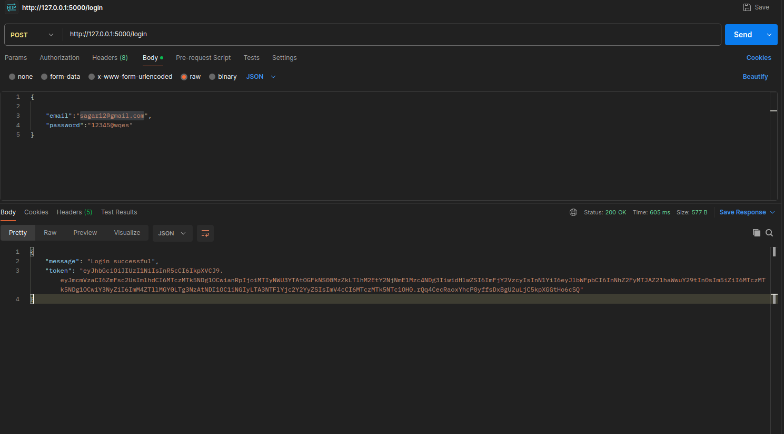
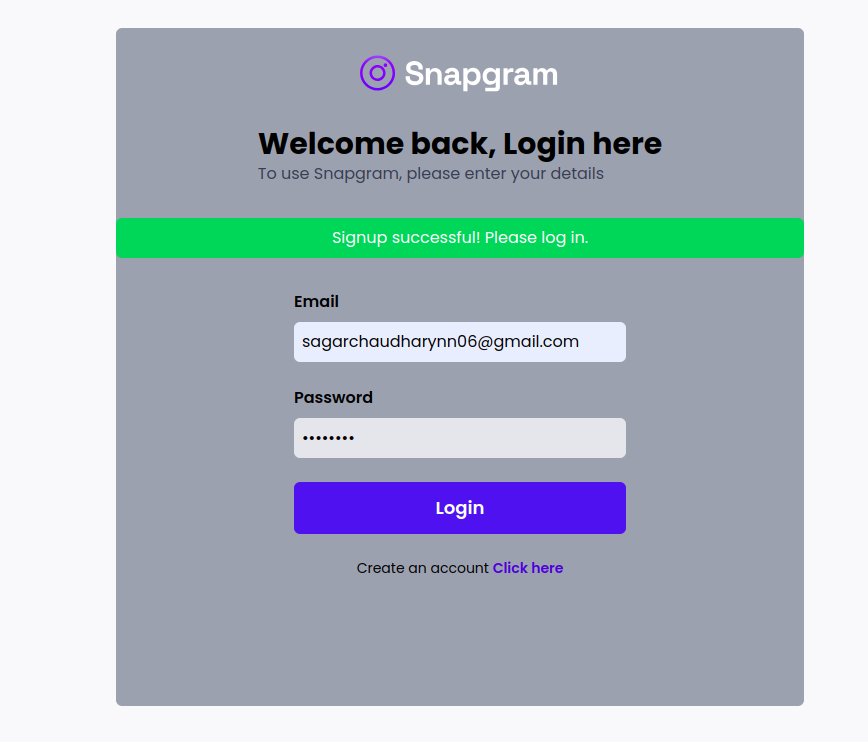
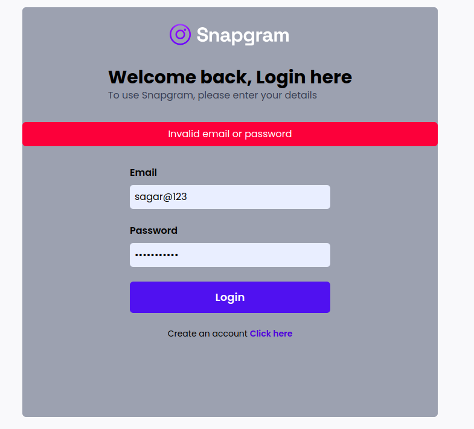
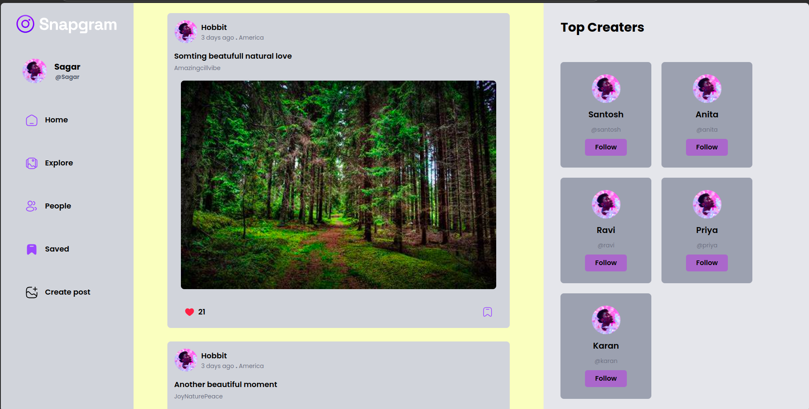
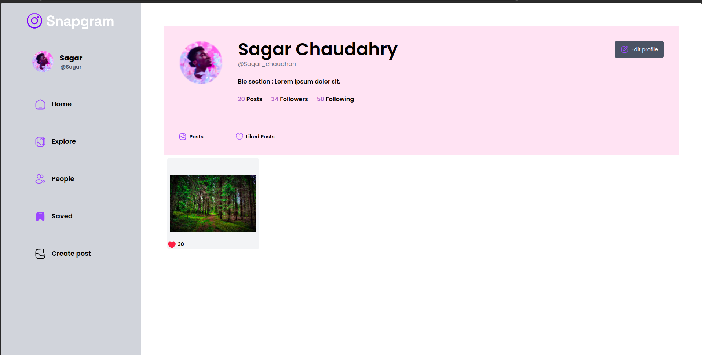
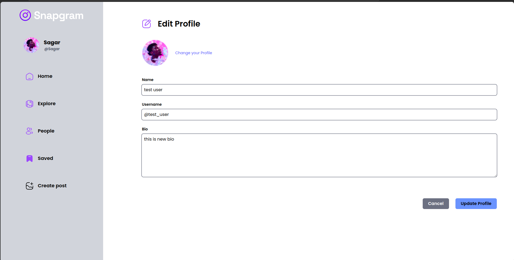

# Forum Application

This is a forum application that includes user registration, login, profile management, and a dashboard page. The application also features a "like" feature where each user can click only once, ensuring unique interactions with the posts.
## Tech Stack:
- **Frontend**: React.js (for building the user interface)
- **Backend**: Flask (for handling API requests)
- **Database**: MongoDB (for storing user data and forum posts)
- **JWT**: For user authentication (JSON Web Tokens)
- **Password Hashing**: Secure password storage using Flask's `werkzeug.security` module

## OUTPUT(DEMO):
### 1. API Testing


### 2. Login and Sign up
|  |  |

### 3. Home Page


### 4. Profile


### 5. Edit Profile



### Installation:

1. Clone the repository:
   ```bash
   git clone https://github.com/your-username/forum-app.git
   cd forum-app
   ```
2. Backend Setup:
- Navigate to the backend folder and create a virtual environment:

```
cd backend
python -m venv venv
source venv/bin/activate  # For Windows: venv\Scripts\activate
```

- Install the necessary Python packages:
```
Copy code
pip install -r requirements.txt
```
- Start the Flask server:
```
python app.py
```
3. Frontend Setup:

- Navigate to the frontend folder:
```
cd frontend

```
- Install the necessary Node.js packages:
```
npm install
```
- Start the React development server:
```
npm run dev
```

